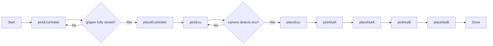
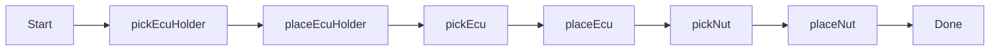
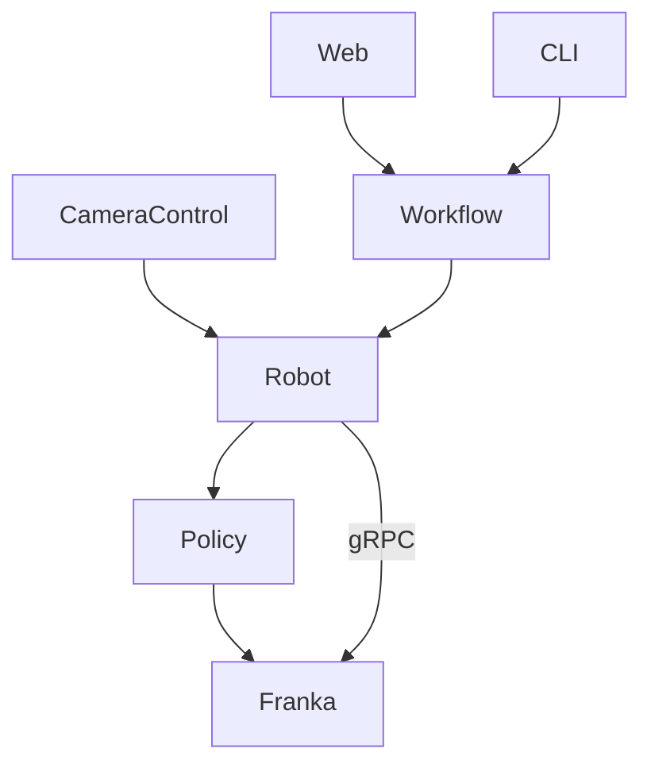

# Hackathon Munich 2025

### Architecture
- `UI`: small webserver to trigger different modes -- **todo**
- `Record`: record raw data using Meta Quest VR
- `Robot`
    - `convert()`: migrate ros dataset to LeRobot dataset
    - `replay()`: replay episode 
    - `train()`: using recorded data to train policy
    - `deploy()`: deploy policy to execute a task
- `Workflow` -- **todo**
    - execute sequence of steps
    - detect if a step failed (e.g. by gripper state) -> retry
    - for simplicity transition to next step after a given duration

---

### Workflow



### Simple Workflow




### Architecture


### Debug
- format video encoding to h264
```bash
ffmpeg -i test-video.mp4 -c:v libx264 -crf 18 -preset fast -pix_fmt yuv420p -c:a copy test-video-h264.mp4
``